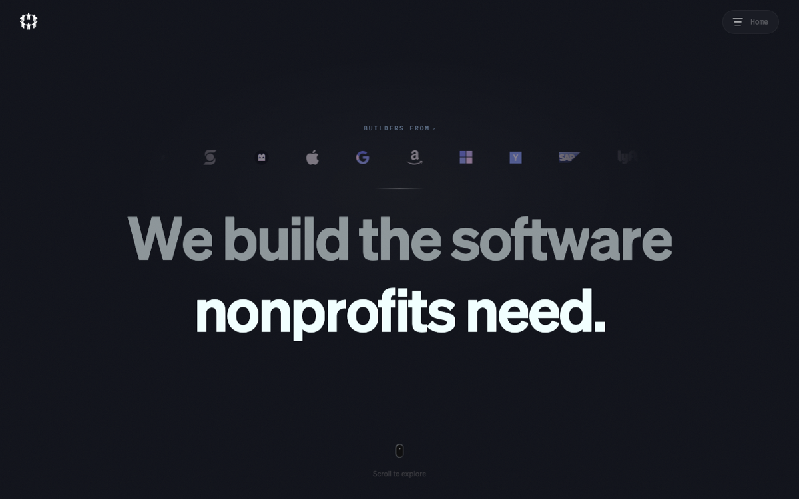
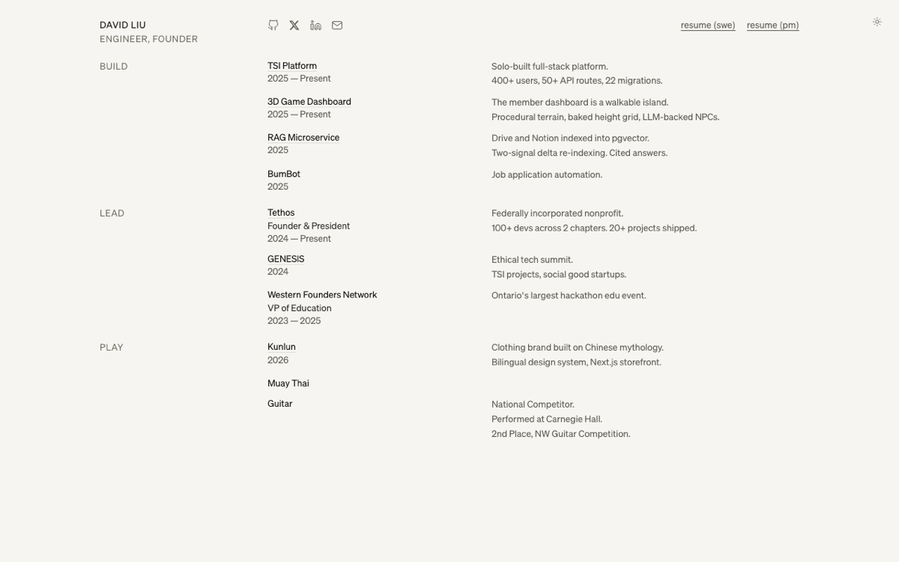

<picture>
  <source media="(prefers-color-scheme: dark)" srcset="assets/banner-dark.svg">
  <source media="(prefers-color-scheme: light)" srcset="assets/banner-light.svg">
  
</picture>

### `$ whoami`

- swe @ western university · 4th year
- now: swe intern @ [j.d. power](https://www.jdpower.com)
- founder & president @ [tethos](https://tethos.ca) · 100+ student devs shipping free software for nonprofits
- before: engineering intern @ modern engineering · vp education @ western founders network

### `$ ps aux | grep building`

- **bumbot** · job hunt on autopilot · finds postings, scores fit, writes cover letters in your voice, auto-applies with playwright · private beta
- **[clawdash](https://github.com/dahan8473/clawdash)** · mission control for shirmp, my 24/7 ai agent on a mac mini · live websocket feed: sessions, cron, token burn
- **[tethos.ca](https://tethos.ca)** · solo-built org platform · 400+ users · 50+ api routes · the member dashboard is a walkable 3d island with llm-backed npcs

### `$ open --live`

| [tethos.ca](https://tethos.ca) | [davidliu.work](https://davidliu.work) |
|---|---|
| [](https://tethos.ca) | [](https://davidliu.work) |

### `$ cat tethos.id`


- client work ships private in [uwo-tsi](https://github.com/UWO-TSI) · multi-agent research pipeline for world vision · grant db for plan international
- public: [tsi-website](https://github.com/UWO-TSI/tsi-website) · [fundhomecare grant aggregator](https://github.com/UWO-TSI/FundhomecareGrantAggregator) · genesis, the annual showcase

### `$ tree ~/projects --story`

`├──` [tsi-website](https://github.com/UWO-TSI/tsi-website) · tethos.ca source · procedural-terrain island dashboard, baked height grid, llm npcs · next.js · supabase · fastapi<br>
`├──` **tsi sidekick** (private) · rag microservice: drive + notion indexed into pgvector, two-signal delta re-indexing, cited answers<br>
`├──` [deja-view](https://github.com/dahan8473/deja-view) · pinterest board in, 3d objects in your room out · hackathon<br>
`├──` [biopilot](https://github.com/dahan8473/biopilot) · drone imagery in, crop-health heatmaps out · deck.gl · computer vision · hackathon<br>
`├──` kunlun (private) · clothing brand built on chinese mythology · bilingual design system · next.js storefront<br>
`└──` [wec_24](https://github.com/dahan8473/WEC_24) · western engineering competition 2024 · unity · c#

### `$ cat stack.txt`

```text
┌────────────┬────────────────────────────────────────────────┐
│ languages  │ typescript · python · c# · java · sql          │
│ frontend   │ react · next.js · tailwind · three.js / r3f    │
│ backend    │ fastapi · prisma · supabase · postgres         │
│ ai/agents  │ claude api · rag pipelines · playwright · mcp  │
│ tools      │ vercel · docker · unity · figma                │
└────────────┴────────────────────────────────────────────────┘
```

### `$ top`

<picture>
  <source media="(prefers-color-scheme: dark)" srcset="https://raw.githubusercontent.com/dahan8473/dahan8473/output/snake-dark.svg">
  <source media="(prefers-color-scheme: light)" srcset="https://raw.githubusercontent.com/dahan8473/dahan8473/output/snake-light.svg">
  
</picture>

### `$ wall`

sign it: [**leave a message**](https://github.com/dahan8473/dahan8473/issues/new?title=wall%7Cyour+message+here&body=edit+the+title%3A+keep+%22wall%7C%22+and+replace+the+rest+with+your+message%2C+then+submit.+a+bot+adds+you+to+the+wall+and+closes+this+issue.) · a workflow adds you here and closes the issue

<!--WALL:START-->
```text
$ cat /var/log/wall
  @dahan8473: first  (Jul 16)
```
<!--WALL:END-->

### `$ ping david`

[gmail](mailto:davidliu8473@gmail.com) · [linkedin](https://linkedin.com/in/davidmakesmoves) · [davidliu.work](https://davidliu.work) · [tethos.ca](https://tethos.ca)
