<picture>
  <source media="(prefers-color-scheme: dark)" srcset="assets/banner-dark.svg">
  <source media="(prefers-color-scheme: light)" srcset="assets/banner-light.svg">
  
</picture>

### `$ whoami`

- swe @ western university · 4th year
- now: swe intern @ [j.d. power](https://www.jdpower.com)
- founder & president @ [tethos](https://tethos.ca) · 100+ student devs shipping free software for nonprofits
- before: engineering intern @ modern engineering

### `$ ps aux | grep building`

- **bumbot** · applies to jobs while you sleep · finds postings, scores fit, writes cover letters in your voice, auto-applies · private beta
- **[clawdash](https://github.com/dahan8473/clawdash)** · mission control for shirmp, my 24/7 ai agent on a mac mini · live websocket feed: sessions, cron, token burn
- **[tethos.ca](https://tethos.ca)** · the org platform, solo-built · 400+ users · 22 api endpoints · 3d dashboard · rag assistant

### `$ cat tethos.id`



- client work ships private in [uwo-tsi](https://github.com/UWO-TSI) · multi-agent research pipeline for world vision · grant db for plan international
- public: [tsi-website](https://github.com/UWO-TSI/tsi-website) · [fundhomecare grant aggregator](https://github.com/UWO-TSI/FundhomecareGrantAggregator)

### `$ tree ~/projects`

`├──` [tsi-website](https://github.com/UWO-TSI/tsi-website) · tethos.ca source · next.js · supabase · fastapi · react three fiber<br>
`├──` [deja-view](https://github.com/dahan8473/deja-view) · pinterest board in, 3d objects in your room out · hackathon<br>
`├──` [biopilot](https://github.com/dahan8473/biopilot) · drone imagery in, crop-health heatmaps out · computer vision · hackathon<br>
`├──` kunlun · bilingual fashion house site · lore-anchored design · private<br>
`└──` [wec_24](https://github.com/dahan8473/WEC_24) · western engineering competition 2024 · unity · c#

### `$ cat stack.txt`

```text
┌────────────┬────────────────────────────────────────────────┐
│ languages  │ typescript · python · c# · java · sql          │
│ frontend   │ react · next.js · tailwind · three.js / r3f    │
│ backend    │ fastapi · prisma · supabase · postgres         │
│ ai/agents  │ claude api · rag pipelines · playwright · mcp  │
│ tools      │ vercel · docker · unity · figma                │
└────────────┴────────────────────────────────────────────────┘
```

### `$ ping david`

[gmail](mailto:davidliu8473@gmail.com) · [linkedin](https://linkedin.com/in/davidmakesmoves) · [davidliu.work](https://davidliu.work) · [tethos.ca](https://tethos.ca)
