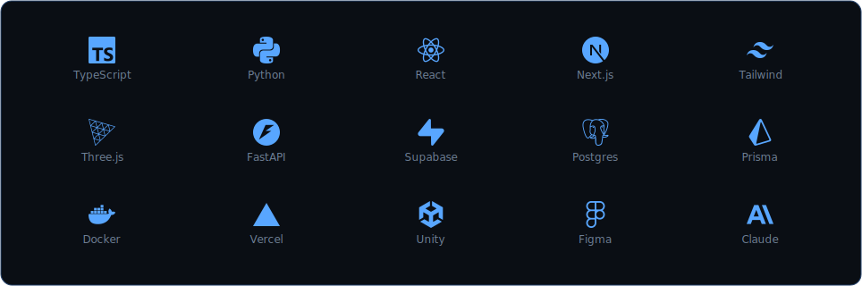
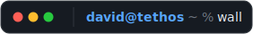

<picture>
  <source media="(prefers-color-scheme: dark)" srcset="assets/banner-dark.svg">
  <source media="(prefers-color-scheme: light)" srcset="assets/banner-light.svg">
  
</picture>

<picture><source media="(prefers-color-scheme: dark)" srcset="assets/hdr/work-dark.svg"><source media="(prefers-color-scheme: light)" srcset="assets/hdr/work-light.svg"></picture>

**bumbot** — job applications on autopilot: finds postings, scores fit, writes cover letters in your voice, auto-applies · Next.js · Playwright · Claude · _private beta_<br>
**[clawdash](https://github.com/dahan8473/clawdash)** — mission control for shirmp, my 24/7 ai agent on a mac mini · live websocket feed of sessions, cron, token burn<br>
**[tethos.ca](https://github.com/UWO-TSI/tsi-website)** — the org platform, solo-built · 400+ users · 50+ api routes · walkable 3d island dashboard with llm npcs<br>
**tsi sidekick** — rag microservice: drive + notion → pgvector, delta re-indexing, cited answers · _private_<br>
**[deja-view](https://github.com/dahan8473/deja-view)** — pinterest board in, 3d objects in your room out · _hackathon_<br>
**[biopilot](https://github.com/dahan8473/biopilot)** — drone imagery in, crop-health heatmaps out · deck.gl · _hackathon_<br>
**kunlun** — bilingual fashion brand, chinese-mythology design system · _private_<br>
**[wec_24](https://github.com/dahan8473/WEC_24)** — western engineering competition 2024 · unity · c#

<picture>
  <source media="(prefers-color-scheme: dark)" srcset="assets/stack-dark.svg">
  <source media="(prefers-color-scheme: light)" srcset="assets/stack-light.svg">
  
</picture>

<picture><source media="(prefers-color-scheme: dark)" srcset="assets/hdr/commits-dark.svg"><source media="(prefers-color-scheme: light)" srcset="assets/hdr/commits-light.svg"></picture>

<picture>
  <source media="(prefers-color-scheme: dark)" srcset="https://raw.githubusercontent.com/dahan8473/dahan8473/output/snake-dark.svg?v=6">
  <source media="(prefers-color-scheme: light)" srcset="https://raw.githubusercontent.com/dahan8473/dahan8473/output/snake-light.svg?v=6">
  
</picture>

<picture><source media="(prefers-color-scheme: dark)" srcset="assets/hdr/wall-dark.svg"><source media="(prefers-color-scheme: light)" srcset="assets/hdr/wall-light.svg"></picture>

sign it: [**leave a message**](https://github.com/dahan8473/dahan8473/issues/new?title=wall%7Cyour+message+here&body=edit+the+title%3A+keep+%22wall%7C%22+and+replace+the+rest+with+your+message%2C+then+submit.+a+bot+adds+you+to+the+wall+and+closes+this+issue.) · a workflow adds you here and closes the issue

<!--WALL:START-->
```text
$ cat /var/log/wall
  @dahan8473: first  (Jul 16)
```
<!--WALL:END-->

---

`→` [gmail](mailto:davidliu8473@gmail.com) · [linkedin](https://linkedin.com/in/davidmakesmoves) · [davidliu.work](https://davidliu.work) · [tethos.ca](https://tethos.ca)
