### `$ whoami`

- swe @ western university · 4th year
- currently: swe intern @ [j.d. power](https://www.jdpower.com)
- founder & president @ [tethos](https://tethos.ca) · student devs building free software for nonprofits
- prev: engineering intern @ modern engineering

### `$ ps aux | grep building`

- **bumbot** · job application automation saas · scrapes postings, scores fit, writes cover letters, auto-applies · private beta
- **[clawdash](https://github.com/dahan8473/clawdash)** · mission control for my always-on ai agent (mac mini) · live websocket feed of sessions, cron, token spend
- **[tethos.ca](https://tethos.ca)** · solo-built org platform · 400+ users · 22 api endpoints · 3d dashboard · rag assistant

### `$ cat tethos.id`


- most client work is private in [uwo-tsi](https://github.com/UWO-TSI) · multi-agent research pipeline (world vision) · grant db (plan international)
- public: [tsi-website](https://github.com/UWO-TSI/tsi-website) · [fundhomecare grant aggregator](https://github.com/UWO-TSI/FundhomecareGrantAggregator)

### `$ ls ~/projects`

- [tsi-website](https://github.com/UWO-TSI/tsi-website) · the tethos platform · next.js · supabase · fastapi · react three fiber
- [deja-view](https://github.com/dahan8473/deja-view) · pinterest saves become 3d objects in your room · hackathon
- [biopilot](https://github.com/dahan8473/biopilot) · ai drone crop analytics · computer vision heatmaps · hackathon
- kunlun · bilingual cultural fashion brand site · next.js · private
- [wec_24](https://github.com/dahan8473/WEC_24) · western engineering competition 2024 · unity · c#

### `$ cat stack.txt`

```text
┌────────────┬────────────────────────────────────────────────┐
│ languages  │ typescript · python · c# · java · sql          │
│ frontend   │ react · next.js · tailwind · three.js / r3f    │
│ backend    │ fastapi · prisma · supabase · postgres         │
│ ai/agents  │ claude api · rag pipelines · playwright · mcp  │
│ tools      │ vercel · docker · unity · figma                │
└────────────┴────────────────────────────────────────────────┘
```

### `$ ping david`

[gmail](mailto:davidliu8473@gmail.com) · [linkedin](https://linkedin.com/in/davidmakesmoves) · [davidliu.work](https://davidliu.work) · [tethos.ca](https://tethos.ca)
