<picture>
  <source media="(prefers-color-scheme: dark)" srcset="assets/profile-dark.svg">
  <source media="(prefers-color-scheme: light)" srcset="assets/profile-light.svg">
  
</picture>

`→ repos ` [snake-and-commits](https://github.com/dahan8473/snake-and-commits) · [clawdash](https://github.com/dahan8473/clawdash) · [deja-view](https://github.com/dahan8473/deja-view) · [biopilot](https://github.com/dahan8473/biopilot) · [tethos.ca](https://github.com/UWO-TSI/tsi-website) 
`→ reach ` [gmail](mailto:davidliu8473@gmail.com) · [linkedin](https://linkedin.com/in/davidmakesmoves) · [davidliu.work](https://davidliu.work) · [tethos.ca](https://tethos.ca) 
`→ wall  ` [leave a message](https://github.com/dahan8473/dahan8473/issues/new?title=wall%7Cyour+message+here&body=edit+the+title%3A+keep+%22wall%7C%22+and+replace+the+rest+with+your+message%2C+then+submit.+a+bot+adds+you+to+the+wall+and+closes+this+issue.) · it appears on the wall above within a couple minutes

<!--WALL:START--><!--WALL:END-->
